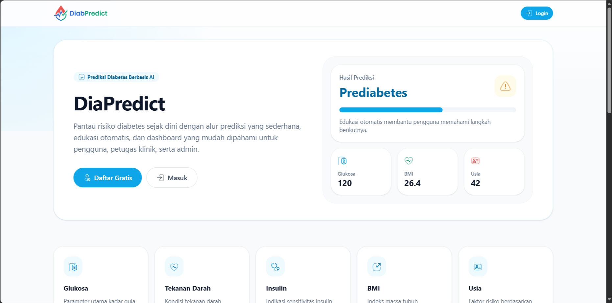
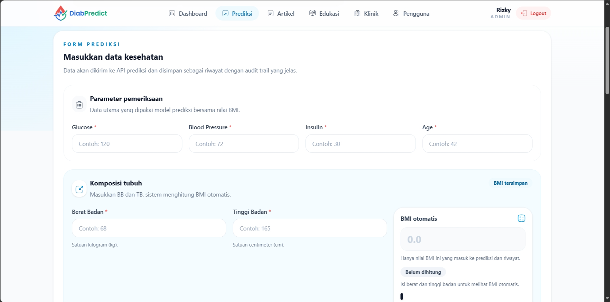
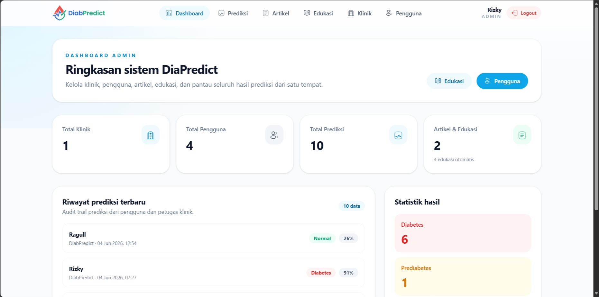

<div align="center">


# DiabPredict

### Sistem Prediksi Risiko Diabetes Berbasis Website Menggunakan Logistic Regression


A web-based diabetes risk prediction system that helps users identify potential diabetes risks early using a Logistic Regression machine learning model. The system also provides educational content and prediction history to support public health awareness.

</div>

---

## 📖 Overview

Diabetes mellitus is one of the most common chronic diseases worldwide. Early detection can help reduce complications and improve quality of life.

**DiabPredict** is a web application developed to:

- Predict diabetes risk based on user health data.
- Provide early screening support.
- Present prediction results in an easy-to-understand format.
- Store prediction history for future reference.
- Deliver educational information about diabetes prevention.

This project was developed as part of an undergraduate thesis in Informatics Engineering.

---

## ✨ Features

### Public Features

- Home Page
- Diabetes Education
- Diabetes Risk Prediction
- Prediction Result Visualization
- Responsive User Interface

### User Features

- Authentication
- Personal Dashboard
- Prediction History
- Profile Management

### Admin Features

- Dashboard Analytics
- User Management
- Prediction Data Monitoring
- Educational Content Management
- System Statistics

---

## 🏗 System Architecture

```text
┌─────────────┐
│   Browser   │
└──────┬──────┘
       │
       ▼
┌─────────────┐
│ Laravel 13  │
│ Web System  │
└──────┬──────┘
       │ REST API
       ▼
┌─────────────┐
│ Python API  │
│ Logistic    │
│ Regression  │
└──────┬──────┘
       │
       ▼
┌─────────────┐
│ ML Model    │
│ Diabetes    │
│ Prediction  │
└─────────────┘
```

---

## 🧠 Machine Learning Model

The prediction engine uses:

- Logistic Regression
- StandardScaler
- Scikit-Learn Pipeline
- Binary Classification

### Input Features

| Feature       | Description         |
| ------------- | ------------------- |
| Glucose       | Blood glucose level |
| BloodPressure | Blood pressure      |
| Insulin       | Insulin level       |
| BMI           | Body Mass Index     |
| Age           | Age                 |

### Output

| Result    | Description                    |
| --------- | ------------------------------ |
| Low Risk  | Lower possibility of diabetes  |
| High Risk | Higher possibility of diabetes |

---

## 🛠 Tech Stack

### Backend

- Laravel 13
- PHP 8.3
- MySQL

### Frontend

- Blade
- Tailwind CSS 4
- Livewire 4

### Machine Learning

- Python
- Pandas
- NumPy
- Scikit-Learn
- Joblib

---

## ⚙️ Installation

### Clone Repository

```bash
git clone https://github.com/username/diabpredict.git
cd diabpredict
```

### Install Dependencies

```bash
composer install
```

```bash
npm install
```

### Environment Configuration

```bash
cp .env.example .env
```

Generate application key:

```bash
php artisan key:generate
```

Configure database in:

```env
DB_DATABASE=diabpredict
DB_USERNAME=root
DB_PASSWORD=
```

### Run Migration

```bash
php artisan migrate
```

### Run Frontend

```bash
npm run dev
```

### Start Laravel Server

```bash
php artisan serve
```

---

## 📸 Screenshots

### Landing Page



### Prediction Page



### Dashboard



---

## 📄 License

This project is developed for educational and research purposes.

MIT License

---

## ⭐ Support

If you find this project useful, please consider giving it a star on GitHub.

```
⭐ Star this repository if it helps you!
```
